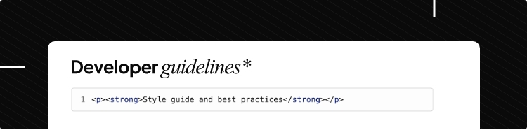

These guidelines provide coding standards, patterns, and best practices for developers and AI agents working on ainsley.dev projects. They are designed to ensure consistency, maintainability, and quality across all codebases.

## Purpose

These guidelines serve multiple purposes:

- **Consistency**: Establish common patterns and conventions across projects.
- **Quality**: Promote best practices that lead to maintainable, testable code.
- **Onboarding**: Help new developers and AI agents understand our coding standards.
- **Collaboration**: Create a shared language for code reviews and technical discussions.

## How to Use These Guidelines

- Browse the sections in the navigation to find language-specific guidelines.
- Each section contains practical examples and patterns observed in our codebases.
- These are living documents that evolve as our practices improve.
- When in doubt, consistency with existing code in the project should take precedence.

## General Principles

Across all languages and frameworks, we follow these core principles:

- **Clarity over cleverness**: Write code that is easy to understand and maintain.
- **Test your code**: Write tests that verify behaviour, not implementation details.
- **Document intent**: Comment on the "why", not the "what".
- **Use British English**: All content and comments use British spellings.
- **Review before committing**: Run linting, formatting, and tests before pushing code.

## Contributing

These guidelines are based on patterns observed in our codebases, including:

- [webkit](https://github.com/ainsleydev/webkit) - Go CLI tool for web project scaffolding
- [search-spares](https://github.com/ainsleydev/search-spares) - SvelteKit and Payload CMS application

If you notice patterns or practices that should be documented, or if guidelines need clarification, please contribute by updating the relevant sections.
