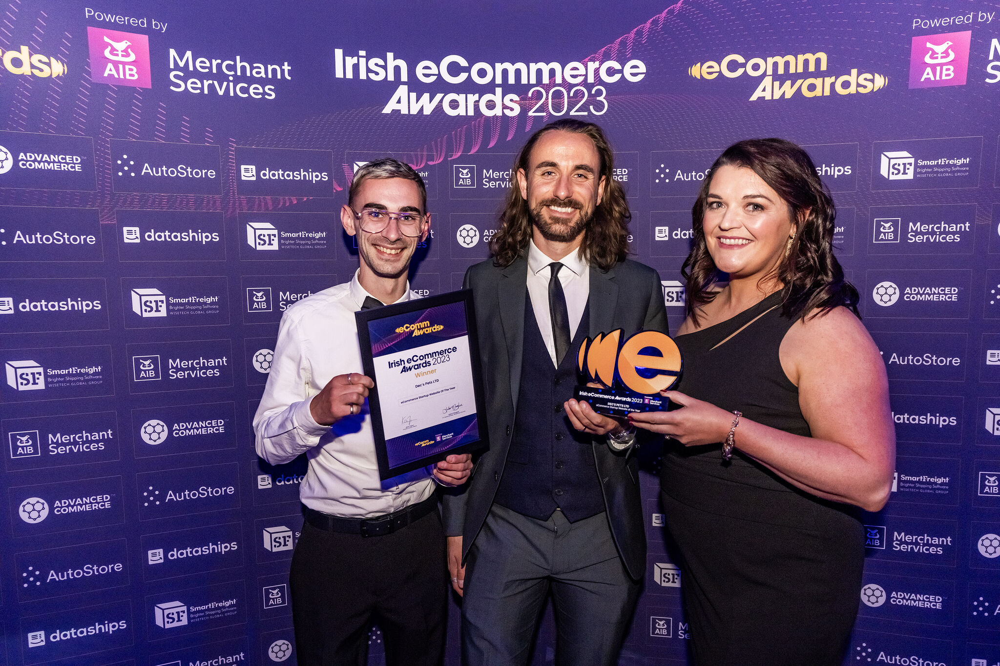
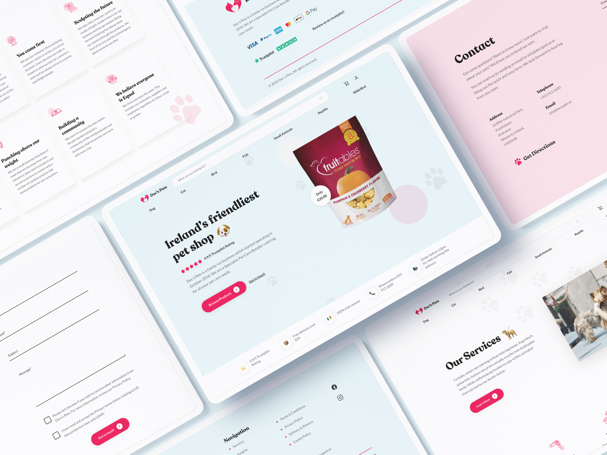


Congratulations to our client [Dec's Pets](https://decspets.ie/) on winning the E-Commerce Startup Website of the Year at
the [Irish eCommerce Awards 2023](https://ecommawards.ie/).


## How we helped

Looking to expand their reach in Ireland and establish a wider online presence, [ainsley.dev](http://ainsley.dev) was
tasked with rebranding and modernising Dec’s Pets’ original website. A playful redesign was implemented, featuring a
light blue and pink colour palette, along with a custom ‘paw’ logo to reflect the brand's fun, family-friendly ethos.

Rebuilding on WordPress and WooCommerce, we created a fast, easy-to-use platform for customers to shop from Dec's Pets'
vast catalogue of pet products online, while increasing the company's visibility and cementing its position in the
growing e-commerce market. Custom graphics and integrations were made, such as
the [Dec’s Pets Tags](https://decspets.ie/tags/), which features a 3D scroll animation and
striking [marketing video](https://www.linkedin.com/posts/decspets_decs-pets-tag-builder-is-now-live-activity-7004073520213196800-YN9R?utm_source=share&utm_medium=member_desktop).
Our content team also crafted a number of search engine optimised insights for their company blog on unique,
industry-related topics, such as [a guide on cat training](https://decspets.ie/insights/a-guide-to-training-your-cat/)
and [travelling safely with your dog](https://decspets.ie/insights/how-to-travel-safely-with-your-dog/).
These [bespoke services](https://ainsley.dev/services/) helped Dec’s Pets become a formidable force in the pet industry.

In order to aid Dec’s Pets’ sustainability efforts, [ainsley.dev](http://ainsley.dev) also curated a bespoke integration
with [GreenSpark](https://www.getgreenspark.com/), a community on a mission to tackle climate change. This
implementation has resulted in Dec’s Pets planting thousands of trees to create a sustainable future for our planet.

## E-Commerce awards

The Irish E-Commerce Awards is the biggest celebration of Irish eCommerce retailers, software providers, agencies and
entrepreneurs. [This particular award](https://ecommawards.ie/categories/) recognises exceptional eCommerce websites
less than 30 months old and considers how a website adds value to the end user and sets itself apart from competitors.
Dec's Pets was praised for achieving rapid and clear results by focusing on two key brand and eCommerce attributes –
expertise and efficiency. Feedback also showed that Dec's Pets stands up well against current leading players in the
market and matches them in terms of features, positioning itself as an expert player in the industry.

## The future

[Winning awards](https://ainsley.dev/insights/web-design-awards/) for the design and development of your website is a
great way of boosting your business’ online presence and setting yourself apart from the competition. We are proud to
have played a part in Dec’s Pets’ journey and look forward to seeing what the future holds for this thriving company. If
you’d also like the chance to win awards for your business, [get in touch](https://ainsley.dev/contact/) with our team
to see what we can do for you.

