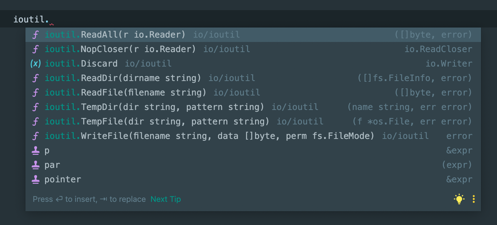
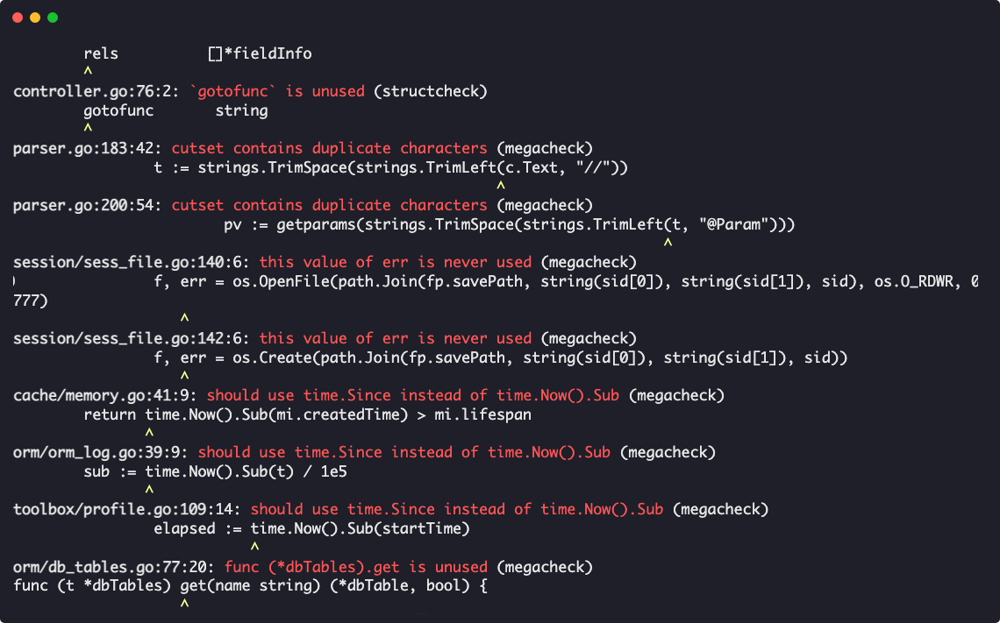


Writing packages for internal use, or developing open source projects? Go packages with clean and clear APIs will
increase the chances of them being reused and maintained. Explore best practices, goals, and idioms that help make
well-crafted packages with the tips below.


## Packages

A GoLang package is simply a folder containing Go files. They should be grouped together by responsibility or behaviour.
You should have a reason for creating a new package and it should be elegant, but obvious in what it's trying to solve.
Think about who will be using your project and packages and where it will be used.

Packages should have purpose and meaning. Try not to create them just because you feel you need to. Sometimes a flat
directory structure works. Nevertheless, as you continue to grow your packages, it makes sense to separate them by
responsibility.

### Naming

**A great package starts with a name**. It should be short, unique, describe what it’s doing and derive from its
purpose. Ask yourself “What does this package provide?” instead of “What is in this package?”

* Avoid clashing with the standard library, for example `http`. This can cause confusing imports.
* Avoid plurals; prefer `stringslice` over `stringslices`.

>Name your packages after what they provide, not what they contain.
> <cite>[Dave Cheeney](https://dave.cheney.net/2019/01/08/avoid-package-names-like-base-util-or-common)</cite>

[Drone’s](https://github.com/harness/drone) directory structure, layout and idioms are extremely well-crafted. You can
see the directory structure of the project below.


### Files

Name your Go files as to what they are. Don’t try to be too clever here; it should be obvious what the file is
describing. Try to separate Go files into what they are doing within the package.

A great bible for naming things in Go is the standard library. Multiple `.go` files are broken down into
responsibilities and clear use cases.

### Avoid Util

Packages that are named `util`, `helpers` or `common` contain an assortment of unrelated functions. Usually they are
made to break an import cycle, but as the project grows in size, the package doesn’t reflect its purpose.

Instead of creating `utility` packages, try to abstract common functions and group them by their behaviour. Below are
two utility functions that calculate the percentage of the given part and total.

```go
// percent.go

// Of calculates what percent [number1] is of [number2].
// ex. 300 is 12.5% of 2400.
func Of(part int, total int) float64 {
    return (float64(part) * float64(100)) / float64(total)
}

// OfFloat calculates what percent [number1] is of [number2].
// ex. 300 is 12.5% of 2400.
func OfFloat(part float64, total float64) float64 {
    return (part * float64(100)) / total
}
```

If these functions were placed in a `util` package, we would have a method signature similar to below:

```go
p := util.PercentOf(1, 100)
```

However, with the package structure illustrated above, our method signature changes to:

```go
p := percent.Of(1, 100)
```

This is more declarative, easier to read, and simpler to understand. In addition, we don’t have a spider's web of
arbitrary functions that are completely unrelated to one another.

## Structure

There is no official standard project layout within the realms of GoLang. However, there are well-documented articles
that can guide you through what’s deemed as standard, such as
the [standard GoLang project structure](https://github.com/golang-standards/project-layout) on GitHub.

However, it’s best practice not to create these folders as soon as you start. Only create them if they are necessary.
Sometimes a flat directory structure will suffice, but this entirely depends on your project.

### cmd

Stands for commands. You should include CLI commands and functions within this directory. Popular packages to bootstrap
your command line applications include [Cobra](https://github.com/spf13/cobra) and [CLI](https://github.com/urfave/cli).

### pkg

The main library code should be kept here. Expect users to import these types into their projects. It’s not necessary to
use `/pkg` in smaller projects. [Travis Jeffery](https://travisjeffery.com/b/2019/11/i-ll-take-pkg-over-internal/) goes
over this in more detail.

### internal

Private library code that your end users will not be able to access. This folder is great for obfuscating code and
reducing your API footprint.

### bin

Any bash scripts that are used for generating data, deploying codebases or any other utilities should be stored here.

### testdata

Well, test data. This is usually on a per package level and has been adopted by the Go community to provide files for
testing your API against.

## DDD (Domain Driven Design)

One thing that got me frustrated when moving from PHP to Go was cyclomatic dependencies. The
famous `import cycle not allowed` haunted me until I discovered something: domain driven design (DDD).

### What’s DDD?

DDD was first thought up by Eric Evans in 2003, in a book he published
called [Tackling Complexity in the Heart of Software](https://www.oreilly.com/library/view/domain-driven-design-tackling/0321125215/).
It revolves around the idea of establishing your main types and behaviour in a centralised folder or package, and
having the software implement this behaviour elsewhere.

[Eric Evans](https://www.domainlanguage.com/) establishes that DDD is predicated on the following goals:

* Placing the project's primary focus on the core domain and domain logic.
* Basing complex designs on a model of the domain.
* Initiating a creative collaboration between technical and domain experts to iteratively refine a conceptual model that
  addresses particular domain problems.

### The domain package

When starting a new project, think about the top-level functions and types before even starting to write any code. What
does your application need? What does it do? How is it going to behave? We can then move onto creating the
all-magical `domain` package.

Our domain package describes types (structs) and behaviours (interfaces) that our services will later implement. It can
be called whatever you like – `domain`, `types`, `definitions` or **even the name of the package you are creating;** but
the main takeaway is that it should not import **anything from other parts of your project.** It should be a reference
point for types across the whole application, which eliminates cyclomatic dependencies.

Say we have a file upload system we need to implement:

```go
type (
    // File represents a singular file entity that has been
    // uploaded to the system.
    File struct {
		ID   	int   	`db:"id" json:"id"`
		UUID 	uuid.UUID   `db:"uuid" json:"uuid"`
		URL  	string	`db:"url" json:"url"`
		Name 	string	`db:"name" json:"name"`
		Path 	string	`db:"path" json:"path"`
		FileSize   int64 	`db:"file_size" json:"file_size"`
    }
    // FileRepository defines the methods for modifying files on
    // the system.
    FileRepository interface {
		List() ([]File, error)
		Find(id int64) (File, error)
		Upload(f File) error
		Update(f File) error
		Delete(id int64) error
    }
)
```

Here we have described a `File` and a `FileRepository`. The _File_ being our type and _Repository_ being our behaviour.

The great thing about this approach is that we can encapsulate functions specific to a type within the domain layer. For
example, if we want to find out the extension of our file or check if the file exists on the local storage system, we
can do so by using a method receiver and gaining access to the struct fields.

```go
// Extension returns the extension of the file.
func (f File) Extension() string {
	return filepath.Ext(f.Name)
}

// Exists determines if the file exists on the local
// file system.
func (f File) Exists() bool {
    _, err := os.Stat(f.Path)
    if err == nil {
		return true
    }
    if errors.Is(err, os.ErrNotExist) {
		return false
    }
	return false
}
```

### Implementation

In our “file” service, we now need to implement the methods as defined in the `FileRepository`. Under a package
called `Files` we can create a new type called `Service` and flesh out the method signatures to implement
the `FileRepository`.

Below is an example of the service with no implementation.

```go
type Service struct {
	// DB Connection?
}

func (s *Service) List() ([]File, error) {
	return nil, nil
}

func (s *Service) Find(id int64) (File, error) {
	return File{}, nil
}

func (s *Service) Upload(f File) error {
	return nil
}

func (s *Service) Update(f File) error {
	return nil
}

func (s *Service) Delete(id int64) error {
	return nil
}
```

## Interfaces

Where possible, try
to [accept interfaces and return structs](https://medium.com/@cep21/what-accept-interfaces-return-structs-means-in-go-2fe879e25ee8);
a fantastic Go mantra that has been adopted by the wider community. This means we should accept polymorphic arguments
and return specific types, which enables the end user to write implementations and pass them to your functions.

### Accepting interfaces

By accepting specific types, we limit the opportunity for the user to use functions in different ways. The function
below accepts a byte buffer and a file (as described in the example above), then reads from a path and writes the
content of the file to the buffer.

```go
func ReadFile(buf *bytes.Buffer, f *File) error {
    file, err := os.ReadFile(f.Name)
    if err != nil {
 		return err
    }
    buf.Write(file)
    return nil
}
```

What happens if the user wants to stream the contents to a http writer? Or write the file contents to another file? If
we used a `io.Writer`, we could achieve this:

```go
func ReadFile(w io.Writer, f *File) error {
    file, err := os.ReadFile(f.Name)
    if err != nil {
		return err
    }
    _, err = w.Write(file)
    if err != nil {
		return err
    }
    return nil
}
```

### Single method

> The bigger the interface, the weaker the abstraction.
> <cite>[Go Proverbs](https://go-proverbs.github.io/)</cite>

Narrow types such as singular method interfaces are **powerful**, as they are extremely easy to implement. For this
reason, users of your package are more likely to implement and digest them. People can also use them as function
adapters if they are singular, making them even more diverse.

By extending our file service, we can extract our `ReadFile()` method to a `FileReader` interface.

```go
type FileReader interface {
	ReadFile(w io.Writer, f *File) error
}
```

Now we don’t have to make assumptions about where to read this file from. It can be from a remote or local file system,
as shown below.

```go
type LocalFS struct{}

func (l LocalFS) ReadFile(w io.Writer, f *File) error {
    // Read from local file system
    return nil
}
```

```go
type RemoteFS struct{}

func (l RemoteFS) ReadFile(w io.Writer, f *File) error {
    // Read from remote file system
    return nil
}
```

### Testing

If you’re writing interfaces for your packages, it’s a good idea to have utility functions that contributors can test
against if they are writing a new implementation. We can utilise the `t.Helper()` function, which marks the test as a
helper function, as shown below.

```go
func TestInterface(t *testing.T) { // More arguments?
    t.Helper()
    // Implement test table
}
```

## Footprints

Leaving a small API footprint in your packages can make for a pleasant experience when potential users consume
them. [Mat Ryer](https://www.youtube.com/watch?v=cmkKxNN7cs4) suggests that having a small list of constants, functions
and types is easier for the user to digest. You don’t have to endlessly scroll through a long list of definitions when
looking for something you need within the package.

Below is an example of the types under `ioutil`. The footprint of the API is very small, and it’s clear to see what
entities there are in the package.

Don’t expose implementations of interfaces if you don't necessarily need to, as it makes the package smaller.



### Changing perspective

Try to look at the API footprint from the end user’s perspective and create examples by using `package_test` files.

> Test files that declare a package with the suffix "_test"
> will be compiled as a separate package, and then linked and
> run with the main test binary.
> <cite>[GoDoc](https://pkg.go.dev/cmd/go@master#hdr-Test_packages)</cite>

For example, using the `FileReader` interface described above, we could test against the local file system and see how
our API looks from the outside in.

```go
package file_test // Note the use of _test here

import (
    "bytes"
    file "errorhandling"
    "testing"
)

func TestFileReader(t *testing.T) {
    l := file.LocalFS{} // file.LocalFS instead of LocalFS
    buf := &bytes.Buffer{}
    err := l.ReadFile(buf, &file.File{ // file.File instead of File
		Name: "gopher.jpg",
		Path: "/var/www",
    })
    if err != nil {
		t.Fatalf("expected nil, got: %s", err.Error())
    }
}
```

### Avoid constructors (where possible)

Sometimes adding `New` to a package isn’t necessary. For example, if we wanted to create a local file system that
accepts a base path to work from and returns a new struct, we could be tempted to create a constructor function like
below:

```go
type LocalFS struct {
    BasePath string
}

func NewLocalFS(path string) *LocalFS {
    return &LocalFS{BasePath: path}
}
```

Using the constructor approach is, admittedly, a lot less to write, but it’s also less verbose. Instantiating by value
is a lot clearer and easier to read.

```go
// Constructor
NewLocalFS("my-path")
// By value
lfs := LocalFS{
    BasePath: "my-path",
}
```

Of course sometimes this simply isn’t possible, as you have to validate or create values for the struct.

## Defaults

Think about what happens to your application in the default state. Where validation is 100% necessary, return errors,
otherwise return default structs and types.

### Flexibility

It’s wise to give the user as much flexibility in your package as possible. Where appropriate, ask the user to provide
an implementation or struct, and if they don’t, fall back to a default.

A great example of this is asking for a `http.Client` as an argument. Users of your package may want to set custom time
outs and transport. It’s easy to set defaults on initialisation like below:

```go
type Service struct {
    client *http.Client
}

func New() *Service{
    return &Service{client: http.DefaultClient}
}
```

However, the following implementation is more flexible by comparison, as we are not **assuming** that the end user wants
to use the default http client. We are still falling back to the standard library `http.DefaultClient` if the `Client`
is nil.

```go
// project.go
type Service struct {
    Client *http.Client
}

func (c *Service) Do() {
    if c.client == nil {
		c.client = http.DefaultClient
    }
    // Make request...
}

// Outside of project
c := Service{
    Client: &http.Client{
		Timeout: time.Second * 10,
    },
}
```

### Config

If you have more than four function arguments, turn them into a `Config` struct. By doing so, it becomes more verbose
and readable as we are passing in types that are explicit.

```go
func SendMail(subject string, to []string, cc []string, bcc []string, content []byte) error {
    // Send some mail
    return nil
}

// Send
err := SendMail("gopher", []string{"hello@gophers.com"}, "", "", []byte("hello"))
if err != nil {
    return err
}
```

```go
func SendMail(cfg Config) error {
    // Send some mail
    return nil
}

c := Config{
    Subject: "gopher",
    To:  	[]string{"hello@gophers.com"},
    Content: []byte("hello"),
}
err := SendMail(c)
if err != nil {
    return err
}
```

Which do you think is more readable? If the former, users will most likely have to refer to the function arguments, and
perhaps even look at the documentation. By using a configuration struct, we can explicitly define which arguments are to
be passed.

### Validation

Validate, validate, validate. If you cannot assign default values to a field, return an error back. Using our
configuration struct above, we can add a `Validate()` method, which ensures that values that are required are validated
against. Below is a simple example of validating a mailer configuration as defined
in [Go Mail](https://github.com/ainsleyclark/go-mail), a popular cross-platform email driver for Go.

```go
func (c Config) Validate() error {
    if c.Subject == "" {
		return errors.New("mail must have a subject")
    }
    if len(c.To) == 0 {
		return errors.New("mail must have recipients")
    }
    if c.Content == nil {
		return errors.New("mail must have content")
    }
    return nil
}
```

## Doc

Established documentation defines how well your package will be consumed. If you provide well laid out, easy to read
documentation to your package, it will increase the chances of your package being used. In contrast, if there is no
documentation or the content is hard to read, it might make potential users shy away from it.

### godoc

Use godoc early, as it extracts and generates great documentation for your packages. Using the command below, you are
able to see the result of godoc before publishing.

```bash
godoc -http=:6060
```

For more detailed tips and tricks for using godoc, see Elliot
Chance’s [post](https://elliotchance.medium.com/godoc-tips-tricks-cda6571549b) on Medium.

### README.md

When writing a readme, ensure to include a catchline that will lure your users in. 80% of repositories will also get
used more if you have a logo or mascot (for open source projects).

Assume you are reading the readme for the first time and you know nothing about the project. Does it indicate what
language it’s written in? Its dependencies? The problem it's trying to solve?

Clear installation instructions at the top of the readme, followed by brief examples, are a must-have for any package
and will help you gain traction in the open source community.

## Tooling

Using a few of the tools below can help improve the readability and maintainability of your package.

### Linting

[golangci-lint ](https://golangci-lint.run/)is a rapid Go linter that integrates well with most IDEs and Github Actions.
Colourised output with in-built linting ensures that code is uniform across the board.

[Go Report Card](https://goreportcard.com/) is also a great way of checking that your code conforms to Go standards, and
you also get a shiny badge alongside it.



### MakeFile

Make files are an easy way to run, set up and test your code. They're a gateway to provide your users with easy tooling
as soon as they clone your package and make it easier for potential developers to contribute to the package.

```makefile
setup:
    go mod tidy
.PHONY: setup

format:
    go fmt ./...
.PHONY: format

lint:
    golangci-lint run ./...
.PHONY: lint

test:
    go clean -testcache && go test -race $$(go list ./... | grep -v tests | grep -v mocks) -coverprofile=coverage.out -covermode=atomic
.PHONY: test

test-v:
    go clean -testcache && go test -race -v $$(go list ./... | grep -v tests | grep -v mocks) -coverprofile=coverage.out -covermode=atomic
.PHONY: test-v

cover: test
    go tool cover -html=coverage.out
.PHONY: cover

doc:
    godoc -http localhost:8080
.PHONY: doc

all:
    $(MAKE) format
    $(MAKE) lint
    $(MAKE) test
```

## Wrapping up

We’ve touched on a few bases on how to create well-crafted packages for GoLang. Just implementing a few of the tricks
and tips above will help your packages become more maintainable, readable and easier to use. Remember to look at other
people’s work! It always helps to see how other people and companies are using Go idioms to their advantage.

## Useful links

* [Writing Beautiful Packages in Go by Mat Ryer](https://www.youtube.com/watch?v=cmkKxNN7cs4)
* [Domain Driven Development (DDD) in GoLang](https://programmingpercy.tech/blog/how-to-domain-driven-design-ddd-golang/)
* [Accept interfaces, return structs by Bryan F Tan](https://bryanftan.medium.com/accept-interfaces-return-structs-in-go-d4cab29a301b)
* [Standard project layout in GoLang](https://github.com/golang-standards/project-layout)
* [Avoid package names like base, util, or common by Dave Cheeney](https://dave.cheney.net/2019/01/08/avoid-package-names-like-base-util-or-common)
* [Input validation in GoLang by Aram Petrosyan](https://medium.com/@apzuk3/input-validation-in-golang-bc24cdec1835)
* [How to write unit tests in Go](https://www.digitalocean.com/community/tutorials/how-to-write-unit-tests-in-go-using-go-test-and-the-testing-package)
