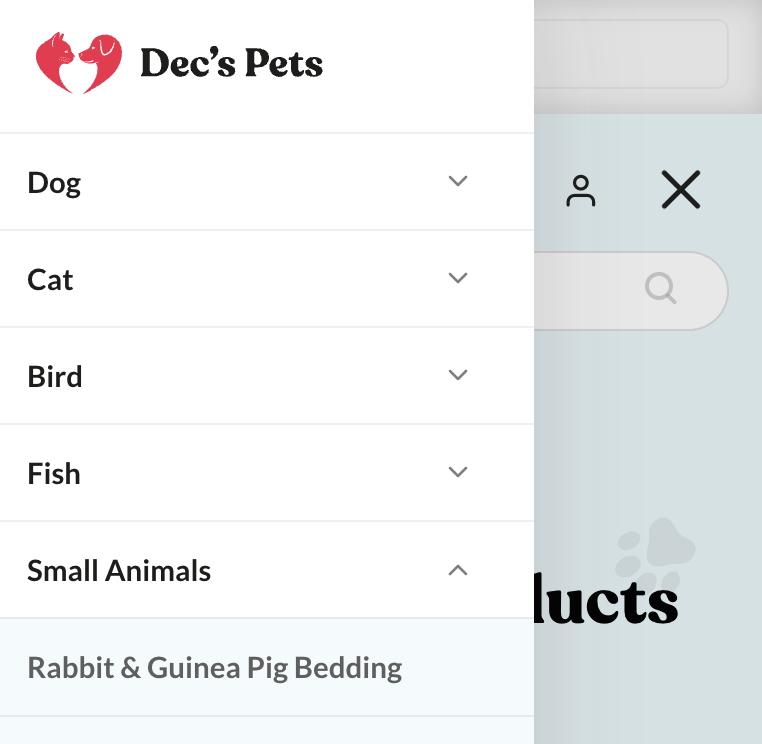
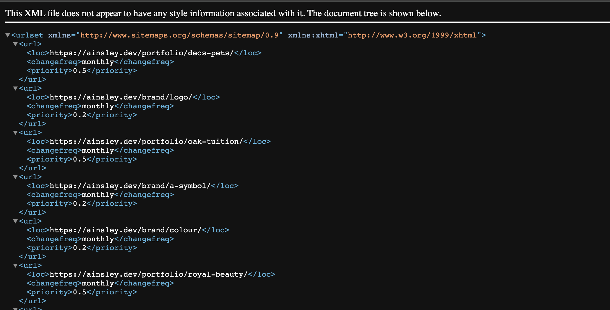


When building a new website, SEO and usability go hand in hand, with one crucial element bridging the two – the
navigation menu. Here we’ll discuss the different types of navigation menu, the pivotal role they play in SEO web design
and development, and some key points to keep in mind. Whether you're a business looking to improve your online presence
or someone offering SEO web design services, this guide will help you enhance both user experience and search engine
performance.



## Types of navigation menu and how they are used

A navigation menu allows users to easily switch between pages on a website. There
are [various kinds used in web design](https://blog.hubspot.com/website/main-website-navigation-ht), with the most
common being header menus, hamburger menus, sidebar menus and footer menus. Let’s look at each one and what they are
typically used for.

### Header menus

These are the most common types of navigation menu. They are located at the top of a webpage in the `<header>` element
and are present on every page of the site, providing quick access to main pages like Home, About Us, Services, and
Contact.

### Hamburger menus

Hamburger menus are a mobile-friendly design choice, represented by three horizontal lines that expand to reveal the
main navigation when clicked. They are great for saving screen space on smaller devices.

### Sidebar menus

These are positioned on the side of a webpage within an `<aside>` lement and are used to display additional navigation
options or subcategories. Particularly useful on sites that are content-rich, they allow easy navigation within each
section of a website.

### Footer menus

As the name suggests, footer menus sit at the bottom of a webpage within the `<footer>` element. Typically used as a
secondary navigation menu, they often include links to business-related information, which needs to be made accessible,
but is less frequently visited by a typical user. They include pages like privacy policies, terms and conditions, and
other important legal and informational content. If a website has
an [HTML sitemap](https://www.semrush.com/blog/html-sitemap/), this will be linked here too.

## How enhancing navigation menus affects SEO

One of the main ways search engines find and crawl content is through navigation menus. This means that having a
well-structured navigation can help search engines understand which pages are most important and, in turn, enhance page
authority.

### Improved user experience

[User experience (UX) design](https://www.uxdesigninstitute.com/blog/ux-design-principles/) is a priority when building
a website. A well thought out navigation menu makes it easier for visitors to find what they are looking for, and should
include web accessibility standards to make it usable for people with disabilities. This will reduce bounce rates and
increase the time users spend on your site – factors search engines consider in ranking websites.

### Enhanced crawling and indexing

Search engine bots rely on navigation menus to discover and index web pages. An optimised menu ensures all essential
pages are accessible and crawlable, positively impacting your website's search visibility.

### Reduced duplicate content

Properly structured menus can help prevent the creation of duplicate content by guiding users to
the [canonical version of a page](https://ahrefs.com/blog/canonical-tags/), which is essential for SEO. It is also
common for developers to implement two navigational menus; one for desktop and one for mobile. This is usually done when
the design for the nav becomes tricky to implement from a technical viewpoint. It is important to only use one `<nav>`
main menu in the site, and work around the design so that it's structured correctly so that search engines are crawling
the same versions. This is crucial when it comes
to[mobile-first indexing](http://botify.com/blog/mobile-first-index-data).



## Key considerations for an SEO-friendly navigation menu

So what can you do to optimise your navigation menu? The most important thing to remember is that it should be clear,
consistent and not overly complex. But if you want your website to stand out, there are some other key technical points
to consider, including the use of sitemaps and Javascript.

### The role of sitemaps in SEO

[Sitemaps](https://backlinko.com/hub/seo/sitemaps) play a vital part in ensuring your website is optimised for search
engines. They list all the pages on your website, helping search engines understand the site's structure. There are two
types to consider – XML and HTML sitemaps. The former are essential for SEO and are submitted to search engines to aid
in indexing usually at the beginning of a migration. On the other hand, HTML sitemaps, which are commonly seen on
smaller **sites although are usually less favoured and are not as powerful as XML**, are user-facing and provide an
easy-to-navigate overview of your website's content. Both types contribute to better SEO performance by ensuring that
all pages are discoverable, but XML is the most crucial part to get right.



### Limiting JavaScript use for better optimisation

While it can enhance the user experience and add functionality to your website, excessive Javascript use can hinder SEO
efforts in your navigation menu. This is because web crawlers that determine relevant links and keywords for search
engines like Google have trouble isolating what they need from its overly complicated code.

It is imperative that the your website menus are rendered server side, meaning when you turn JavaScript off, the menu
remains exactly the same and you can still see the `ahref` links. This allows engines to crawl and prioritise your
site's pages. For more information on how Google crawls and other best practices
visit [Responsibilities as a developer for optimised SEO.](https://ainsley.dev/insights/optimise-seo/)

Always ensure that essential content and links are accessible without JavaScript, and only use it
for [progressive enhancement](https://developer.mozilla.org/en-US/docs/Glossary/Progressive_Enhancement). It’s also
important to be mindful of how it affects mobile users, as excessive scripts can slow down page loading times and
disrupt navigation on handheld devices.

### Accessibility

Its important to use the correct [semantic markup](https://www.w3.org/WAI/tutorials/menus/structure/) for any type of
menu as well as the correct labels to assist with accessibility and screen readers.

Convey the menu by using a list `<ul>` (usually unordered) which allows assistive technologies to announce the number of
items in a menu.

* `aira-current="page"` indicates that the current URL is the one that resides within the nav menu.
* `aria-expanded` denotes that a button (i.e a hamburger) is open.
* `aria-label` helps menus to be found and distinguish between them. This is also particularly helpful for navigational
  buttons.

```html
<nav>
    <button aria-controls="navbar-supported-content" aria-expanded="false" aria-label="Toggle navigation" tabindex=0>
    <i class="hambuger-icon"></i>
</button>
<nav>
	<ul>
		<li class="nav-item active">
			<a class="nav-link" href="/" aria-current="page">Home</a>
		</li>
		<li class="nav-item">
			<a class="nav-link" href="/link">Link</a>
		</li>
		<li class="nav-item">
	</ul>
	</div>
</nav>
```

### Be careful using animations

Although they add dynamism to the website and UI, poorly implemented CSS animations can sometimes slow the user down. We
live in a day and age where people want content, fast. And if you're unable to provide it to them, they may just leave.
Try to make animations smooth and swift to add that extra special touch of UX instead of detracting from it.



## Wrapping up

Optimising your website's navigation menu is a critical aspect of SEO web design and development. It not only elevates
the user experience, but also significantly contributes to enhanced search engine rankings – two key elements that
should be at the forefront of any business’ strategy. So if you’re looking to create a seamless, user-friendly, and
SEO-optimised website for your business, why not hire a professional web design and development agency to boost your
rankings? With [ainsley.dev](http://ainsley.dev)’s [custom web design creations](https://ainsley.dev/portfolio/), we’ve
helped clients from various industries in Kent, London and worldwide elevate their online presence. Check out what we
can do for you [here](https://ainsley.dev/services/).

## Useful links

* [7 Tips For Building SEO + UX-Minded Navigation](https://www.searchenginejournal.com/seo-ux-main-navigation/297965/)
* [How to Create an SEO- Friendly Website Navigation](https://www.botify.com/blog/how-to-create-an-seo-friendly-website-navigation-considerations-navigation-types-and-pro-tips)
* [10 Tips for an SEO-Friendly, Easy to Navigate Website](https://slickplan.com/blog/seo-friendly-easy-to-navigate-website-tips)
* [Are You Making These 5 Common Website Navigation Mistakes?](https://neilpatel.com/blog/common-website-navigation-mistakes/)
* [Make a Great Website Menu for Your Users and for SEO](https://yoast.com/seo-website-menu/)
