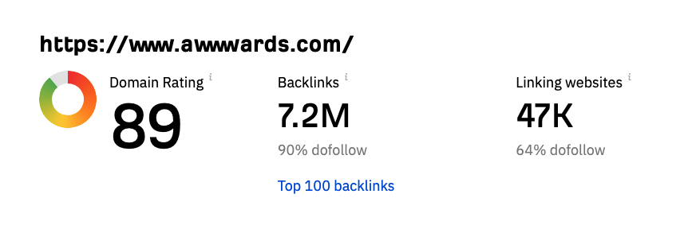


A well-designed and developed website is crucial for the success of any business, and with the sheer amount of fierce
competition online these days, it's essential to stand out and captivate your audience. One great way of achieving this
is by pursuing and showcasing web design awards. Here we’ll explore the main reasons why awards can significantly
benefit your business.


## Build credibility

In a world where online scams and unreliable websites are prevalent, establishing credibility and trustworthiness is
paramount. Receiving recognition for your web design and development in the form of awards from reputable organisations
can serve as a powerful endorsement for your business. This is because when users visit a website showcasing awards,
they are more likely to trust the brand and feel confident engaging with those products or services. In turn, this
increased trust can lead to higher conversion rates, lower bounce rates, and more customer
loyalty. [ainsley.dev](http://ainsley.dev) is a case in point, having received 2.6K new visits ever since
being [featured on awwwards.com](https://www.awwwards.com/sites/ainsley-dev). Therefore, by demonstrating your brand’s
commitment to excellence through awards, you distinguish yourself from competitors and build a strong foundation of
credibility in the online market.

## Enhance visibility

Another huge advantage is that when your website receives awards, it serves as an invitation for journalists, bloggers,
and influencers to take notice. They may be more inclined to write about your business, feature your website in their
articles, or mention it on social media platforms. Many web design award programs, such
as [CSS Design Awards](https://www.cssdesignawards.com/sites/ainsley-dev/43451/), receive extensive media coverage and
have dedicated platforms to showcase the winners.

## Increase your domain rating

Organic publicity can [increase your domain rating (DR)](https://ahrefs.com/blog/how-to-increase-website-authority/)
because of the number of valuable backlinks acquired from being featured
on [a reputable awards website](https://webflow.com/blog/9-agency-awards), thus enhancing your search engine
optimisation (SEO) efforts and further improving your website's visibility. For
example, [awwwards.com](http://awwwards.com) has an incredibly high domain rating of 89, which means that by being
featured on their website you’re essentially obtaining backlinks for free and increasing your domain authority by a
significant margin. Remember that each awards platform does things slightly differently. Some hold one large, annual
website award ceremony, whilst others have awards for periods of time like Site of the Day (SOTD), Site of the Month (
SOTM) and Site of the Year (SOTY), as well as Honourable Mention, with each of these bringing their own percentage of
traffic.

## Gain a competitive advantage

Web design and web development awards offer a unique opportunity to stand out from the crowd and differentiate your
brand. Achieving recognition for exceptional web design, user experience, or innovation sets you apart from competitors
and creates an instant positive impression when a visitor lands on your site. It communicates that you are invested in
providing the best possible experience for your audience, which can sway their decision to choose your business over
others.
By [highlighting your awards strategically](https://understandingecommerce.com/how-to-show-off-achievements-on-your-ecommerce-site/),
such as on your homepage or in promotional materials, you reinforce your competitive advantage and demonstrate why
customers should choose you.

## Wrapping up

Web design and development awards play a crucial role in establishing credibility, enhancing visibility, and gaining a
competitive edge for your business. However, the first step is
establishing [a solid visual design language](https://ainsley.dev/brand/) for your brand. Here is where we can
help. [Get in touch](https://ainsley.dev/contact/) to see how our expert team can craft you an outstanding website that
will build trust with your audience and help increase conversions and potentially higher your chance of winning awards.

## Useful links

* [9 Awards Every Agency Should Know About](https://webflow.com/blog/9-agency-awards)
* [4 Ways Your Business Benefits From Entering Awards](https://allthingsbusiness.co.uk/2022/07/21/business-benefits-from-entering-awards/)
* [How Can Awards Help Your Company?](https://www.business.com/articles/do-awards-really-do-anything-for-your-company/)
* [Why Having an Award-Winning Website Matters](https://medium.com/bornfight-studio/why-does-having-an-award-winning-website-matter-a8b4da814d6f)
[* How to Win an Award for Your Website](https://prismic.io/blog/how-to-win-award-for-website)
