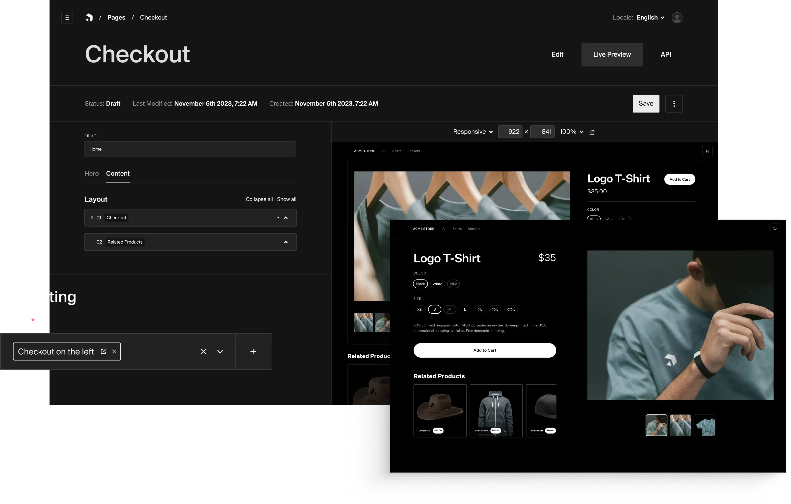


As consumer expectations evolve and market competition intensifies, businesses need e-commerce platforms that show off
their unique value proposition and improve their operational requirements. Custom e-commerce web development offers the
flexibility, functionality, and competitive advantage that off-the-shelf solutions simply cannot match. In this article,
we explain how a custom e-commerce website plays a huge part in the success of your business.


## What is custom e-commerce website development?

Put simply, custom e-commerce development is the process of creating an online shop from scratch or tailoring an
existing platform to meet a business’ specific
needs. [Just like bespoke websites](https://ainsley.dev/insights/prebuilt-vs-custom/), custom e-commerce platforms offer
much more uniqueness and sophistication than default applications. Not only do they cater to a business’ particular
requirements, but they also give customers [the best user experience](https://ainsley.dev/insights/enhancing-ux/) – the
latter being a key factor in transforming leads into conversions. Custom e-commerce web development is sometimes
necessary when an out-of-the-box solution no longer meets a business’ needs.

Source: [Payload CMS](https://payloadcms.com/use-cases/headless-ecommerce)

## Limitations of template-based e-commerce platforms

While popular pre-built e-commerce platforms – like Shopify, Squarespace, Wix and WordPress’ WooCommerce plugin – offer
quick setup and basic functionality, they often fall short when it comes to addressing a business’ unique needs. This
rigidity can restrict a company’s growth, not to mention cause performance constraints that impact loading speeds and
user satisfaction. Template-based solutions can also feel too generic, making a brand easily forgettable in the crowded
marketplace.

## Core benefits of custom e-commerce development

So how can a custom e-commerce website enhance your business’ performance? Let’s explore its main advantages.

### Tailored user experience

Custom e-commerce website development allows your brand to create shopping experiences that perfectly match customer
preferences and behaviours. From personalised product recommendations to streamlined checkout processes, every aspect
can be optimised for your specific audience.

### Smooth integration capabilities

A custom-built e-commerce platform can effortlessly integrate with your existing business systems, including:

* Inventory management software
* CRM systems
* Accounting tools
* Marketing automation platforms
* Custom business applications

### Better performance and scalability

With custom e-commerce, you ensure your platform grows alongside your business. Optimised code and infrastructure
specifically designed for your needs allows for faster loading times, better handling of peak traffic periods and
enhanced security measures. These kinds of enhancements will inevitably lead to improved conversion rates.

### Complete control over features

When working with an e-commerce web development agency, you have full control over your platform’s functionality. This
means implementing exactly what your business needs, such as:

* Custom product configurators
* Unique pricing models
* Specialised shipping calculations
* Bespoke loyalty programmes
* Advanced inventory management

## Wrapping up

Custom e-commerce development provides the foundation for long-term success. As market trends evolve and new
technologies emerge, your custom platform can adapt and integrate new features without the limitations of pre-built
solutions. At [ainsley.dev](https://ainsley.dev/), we specialise in creating bespoke solutions that boost business
growth. With our team by your side, we can work together to create unique, brand-aligned shopping experiences for your
customers and a secure integrated system for your business – all with the added benefit of our ongoing support and
maintenance.

Don’t let generic solutions hold your business back. [Get in touch today](https://ainsley.dev/contact/) to discuss your
custom e-commerce web development needs and start your journey toward a more powerful, profitable online presence.

## Useful links

* [5 Reasons to Go With a Custom Ecommerce Solution](https://www.flowmatters.com/blog/5-reasons-why-you-should-go-with-a-custom-ecommerce-solution/)
* [How Can Custom Ecommerce Benefit Your Business](https://plusworthy.com/custom_post/custom-ecommerce-benefits/)
* [Custom eCommerce Platform vs. Out-of-The-Box: Which is the Better Choice?](https://dynamicweb.com/resources/insights/blog/custom-ecommerce-platform-vs-out-of-the-box-which-is-the-better-choice)
