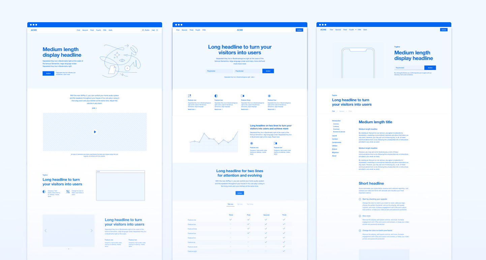


Your website is often the initial interaction potential customers have with your brand, so you’ll want to make a strong
first impression. That’s where custom web design comes in. Unlike template-based websites, a customised web design gives
you a unique online presence tailored specifically to your brand and your target audience’s needs, which in turn
enhances user experience (UX). Prioritising UX with bespoke web design can elevate your site, boost engagement, and
ultimately drive more conversions. Here we provide you with key insights into optimising UX using custom web design. 

## What is UX and why is it important?

Firstly, what exactly is UX? User experience (UX) refers to how a user interacts with and experiences a product, system or service. In web design, good UX ensures your website is intuitive, visually appealing and easy to navigate. Poor UX, on the other hand, can frustrate visitors and send them looking elsewhere. [Custom web design brings you one big step closer to improved UX than a pre-built theme](https://ainsley.dev/insights/prebuilt-vs-custom/), as it allows you to optimise UX from the very start. 

## How can custom web design affect UX?

With customised web design, you’ll have [consistent branding across all your digital assets](https://ainsley.dev/brand/) through the use of your unique logo, colour palette, fonts and more. This strengthens your brand identity, making it easy for potential clients to recognise you in the crowded marketplace and helping to build trust. Customisation also affects search engine optimisation (SEO) – you’ll never outrank your competitors with a website that looks identical to cookie-cutter template sites. Custom web design therefore provides an inherent SEO advantage through high-quality content and an optimised codebase.

## Key ways of enhancing UX

Now we’ve (hopefully) convinced you of the merits of custom web design, you might be wondering what can be done to improve UX. Although there are various techniques experienced developers use, here are some of the most significant ones.

### Using white space

Effective use of white or empty space on a webpage prevents overcrowding and makes your content more digestible. Custom web design allows strategic spacing and breathing room between elements.

### Optimising page speed

Page load times are critical, as even a one-second delay can increase bounce rates, particularly for mobile. An experienced developer will use technical SEO techniques to prioritise performance optimisation through compressed file sizes, efficient hosting and eliminating bloated plugins.

### Including clear calls-to-action

Strategic calls-to-action (CTAs), such as ‘Apply here’ or ‘Sign up now’, guide visitors towards your desired actions. With customised web design, you can control the placement, colours and visibility of CTAs.

### Ensuring responsive design

With over half of web traffic now coming from mobile, responsive design that adjusts for any screen size is non-negotiable. Bespoke websites are built to be responsive across all devices, ensuring a flawless user experience.

### Using hierarchy

Custom design allows you to leverage header tags (H1, H2, H3) to organise content logically and improve scannability and navigation for visitors. This is essential for SEO.

### Incorporating visual elements

Making sure text is broken up using images, videos, bulleted lists and infographics improves readability, engagement and comprehension.

## Wrapping up

Ultimately, partnering with a custom web design and development agency like [ainsely.dev](https://ainsley.dev/) is an investment in creating an unmatched user experience for your target audience. With a fully bespoke website, you can guide visitors effortlessly towards becoming customers by providing a tailored, on-brand experience. At [ainsley.dev](http://ainsley.dev), we believe in bespoke. By listening to our clients’ core values and goals, we strive to capture their unique vision in every design we create. So, if you’re looking to give your online presence a boost, [get in touch](https://ainsley.dev/contact/) today.

## Useful links

* [10 Tips That Can Drastically Improve Your Website’s User Experience](https://blog.hubspot.com/marketing/improve-your-websites-user-experience)
* [Custom Website Design: The Benefits of a Custom-Designed and Built Site](https://www.parashifttech.com/blog/custom-website-design-the-benefits-of-a-custom-designed-and-built-site#:~:text=Custom%20Web%20Design%20Gives%20Your,it%20is%20for%20their%20needs.)
* [5 Critical Benefits of Custom Website Design](https://webolutionsmarketingagency.com/5-critical-benefits-of-custom-website-design/)
