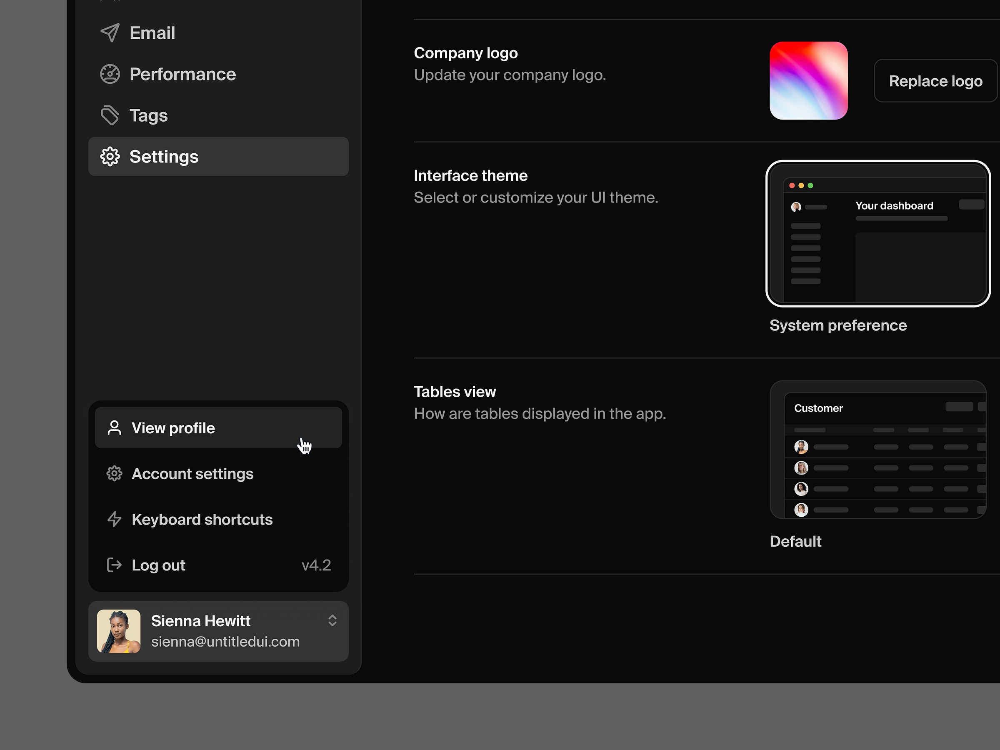


UI/UX services are the need of the hour in the designing world, with official reports claiming that the market reached a
revenue of USD [$2.59 billion in 2022](https://www.fortunebusinessinsights.com/ux-services-market-108780). This number
is only set to increase, with predictions of it hitting USD $32.95 billion by 2030 – that’s a rise of 37.8% Compound
Annual Growth Rate (CAGR).

This data highlights the relevance of user experience (UI) and user interface (UX) in today’s business ecosystem, with
UI/UX designers needing to work towards new industry expectations. Let's explore some relevant trends in the world of
UI/UX design.


## 1. Voice user interface (VUI): A rising trend

Voice user interface, or VUI, helps users to connect their devices using voice commands, with products like Amazon’s
Alexa, Google Assistant, and Apple’s Siri proving highly-popular. This functionality means that UI/UX designers need to
think one step ahead of traditional screen layouts and develop a smooth VUI interface for end-users to schedule various
appointments, control their home automation systems and much more.

## 2. The entry of AI into the UX ecosystem

Artificial intelligence (AI) is also a hot topic in today’s business world. Businesses are applying it in their
processes to eradicate repetitive or fruitless operations, allowing them to free up precious time for other core tasks.
In design, AI can assist by providing intelligent recommendations, as it has the power to examine a large amount of user
data and promptly provide a solution required by the customer. The best example of this is an AI chatbot or virtual
assistant, which some big brands such as H&M and Sephora are now using to help their customers with product
recommendations and order tracking.

## 3. AI & ML in the race

Artificial intelligence (AI) and machine learning (ML) are two other trending topics nowadays. These two technological
frameworks help UI/UX designers to monitor user behaviour and prepare designs based on their findings. So what will
UI/UX designers achieve by implementing AI/ML in their workflow? The answer is simple – they can gain robust data on
personalisation, predictive analytics and more.

Companies are now also able to identify user needs by going through data
patterns. For example, machine learning implemented on e-commerce platforms can suggest other products to customers,
based on their shopping behaviour. This is called predictive analysis, guiding customers towards products they may like.
These technologies help UI/UX designers create platforms that enhance the user journey.

## 4. Minimum but powerful design

Minimalism has now entered the world of UI/UX. But what does this mean for the industry? It’s about creating simple
designs, clean layouts, a soothing colour palette, and simple fonts, all with the aim of improving user experience. Take
the Apple website design, for example. All of Apple’s product pages and mobile applications are so easy to browse,
without any distractions. Looking at these parameters, other platforms, such as Medium and Pinterest, are also following
the same approach.

## 5. The power of dark mode

Dark mode is another feature being embraced, allowing users to switch between light and dark themes. This not only helps
save a large amount of battery life, which is why it has been introduced in OLED TVs and mobile apps, but it also puts
less strain on the eyes in low-light environments. However, the main strength of this feature is adaptability, as dark
mode is usually switched off during the daytime. This means it is essential for UI/UX designers to keep this in mind
while developing dark mode for their applications. The challenge here is building contrasting colour choices that don’t
strain the eyes, all without affecting readability.

## 6. Design for all users

Last but not least, for a design to be successful, it must be accessible to everyone, regardless of ability. UI/UX
designers, therefore, have a duty to consider colour blindness and other visual and auditory impairments when designing
an application. Many countries now favour accessible design and have made it a mandatory requirement. For example,
Microsoft has introduced the accessibility feature in Microsoft Word, which helps users go through documents without any
obstacles. Web Content Accessibility Guidelines (WCAG) have also been put in place to check whether or not applications
are accessible to all. Aspects like colour contrast and font size, as well as tools such as screen readers and voice
recognition, should all be considered by UI/UX designers.

## Wrapping up

All these technological advancements means the future of UI/UX design is filled with opportunities, making it an
attractive industry for new designers to get into. What’s more, many reputable companies provide [UI/UX design services](https://esparkinfo.com/ui-ux-design-services.html)
that can help optimise a website’s overall layout with their core expertise, including the implementation of voice interfaces, AI and machine learning, accessibility and more.

At ainsley.dev, we constantly keep updated on emerging technologies and thrive on putting them to good use in our client
website builds. [Get in touch with us](https://ainsley.dev/contact/) today to discuss how we can build a custom UI/UX
design that’s both in line with your business’ needs and these key industry advancements.

