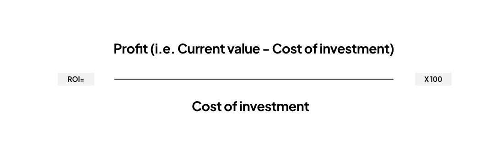


A custom software application tailored to your specific business requirements has the potential to streamline
operations, boost productivity and increase your return on investment (ROI). Off-the-shelf software might serve basic
needs, but to truly gain a competitive edge, more businesses are turning to custom software application development.
Here we’ll explore the benefits of bespoke software, front-end applications and APIs and how they can help maximise your
ROI.


## What is ROI and how is it calculated?

[Return on investment (ROI)](https://www.investopedia.com/terms/r/returnoninvestment.asp) is a way of measuring how well
an investment is performing, compared to how much it cost to implement. To calculate ROI, the profit from an investment
is divided by how much it cost, with the result expressed as a percentage or ratio.

Let’s say you invest 8K in
a [bespoke website build for your business](https://ainsley.dev/insights/prebuilt-vs-custom/). If your net profit for
the whole year following your new website launch amounts to 10K, deduct the cost of your investment, in this case 8K,
then divide this figure by the same investment cost. The result would be 0.25, which means an ROI of 25%. Now you might
be wondering [what a ‘good’ ROI is](https://rockcontent.com/blog/what-is-a-good-roi/). Essentially, a return that
outweighs your initial investment is a step in the right direction and the higher the ROI, the better, but the figure
you aim for can depend on your industry and company goals.

## How can custom software application development increase your ROI?

Now we’ve established the importance of ROI, let’s delve
into [bespoke software applications](https://www.businessnewsdaily.com/5175-custom-software-development.html) and how
they can maximise a business’ ROI.

### What is custom software development?

When businesses require applications with features and functionality that cater to their specific needs, they turn to
custom software application development companies to design and develop bespoke solutions. Unlike off-the-shelf
software, custom applications are built from scratch, tailored to fit seamlessly into existing workflows and address
specific issues.

### What are the benefits of custom software solutions?

Although bespoke software applications involve more financial investment than those which are pre-built, there are a
number of key ways in which they can [enhance workflow](https://stackify.com/7-benefits-of-custom-software-development/)
and ultimately boost your business’ ROI.

### Increased efficiency and productivity

Off-the-shelf software often comes with many features that may not be relevant to your particular business, leading to a
cluttered interface and inefficient workflows. On the other hand, custom software streamlines processes, automates
repetitive tasks, and eliminates unnecessary functions. This leaves time for you to focus on what matters most, thus
increasing productivity and speeding up project completion times.

### Enhanced scalability and flexibility

Due to the inflexibility of generic software applications, it’s often found that they can’t keep up with the
ever-changing needs of many businesses. Conversely, bespoke software solutions are inherently designed to be flexible
and scalable, allowing you to expand and modify features as your business evolves. Whether you want to improve an
existing feature that isn’t working as you want it to or add in a new one, it’s much easier to make these changes with
custom software development.

### Perfect system integration

Bespoke software is designed with your existing tech stack in mind, ensuring seamless integration with other tools and
systems your company already uses. This compatibility not only saves time, but also reduces the likelihood of errors and
data inconsistencies.

### Higher competitive advantage

In a competitive market, differentiation is key to success. By streamlining operations and enabling you to offer unique
services or features, custom software applications can help you attract more clients and gain a reputation for
innovation and excellence within your industry, and in turn increase your ROI.

## Wrapping up

Custom software applications offer businesses an opportunity to achieve unprecedented levels of efficiency and
productivity. At [ainsley.dev](https://ainsley.dev) we have helped multiple companies across London, Kent and worldwide
increase their ROI with our bespoke website and software
builds – [our client success stories](https://ainsley.dev/portfolio/) are testament to this. Find out
how [our tailored solutions](https://ainsley.dev/services/) can really help you unlock the
full potential of your business.

## Useful links

* [Return on Investment (ROI): How to Calculate It and What It Means](https://www.investopedia.com/terms/r/returnoninvestment.asp)
* [What Is a Good Return on Investment (ROI)?What Is a Good Return on Investment (ROI)?](https://www.indeed.com/career-advice/career-development/what-is-a-good-roi)
* [Maximizing ROI through Custom Software](https://www.europeanbusinessreview.com/maximizing-roi-through-custom-software/)
* [How to Maximize ROI with Custom Software Development Outsourcing](https://gisuser.com/2023/04/how-to-maximize-roi-with-custom-software-development-outsourcing/)
* [The Ultimate Guide to Software ROI: How to Get the Most Out of Your Investments](https://scribehow.com/library/software-roi)
