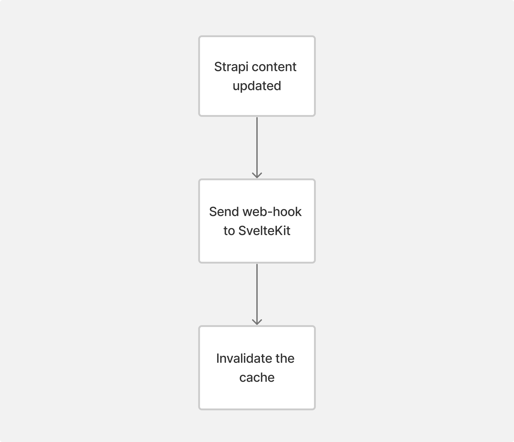
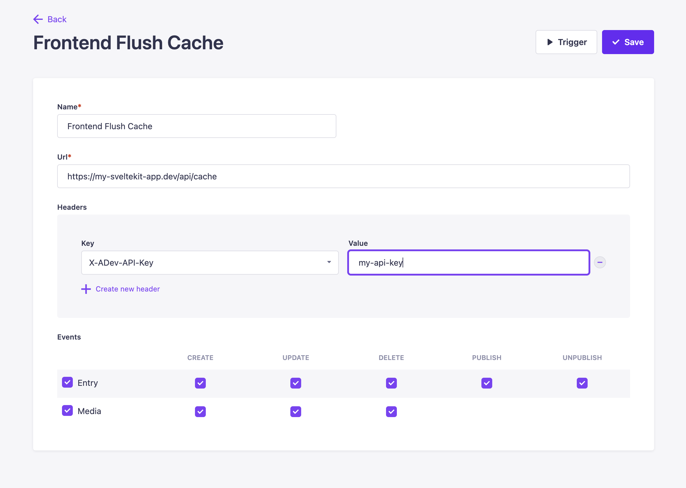
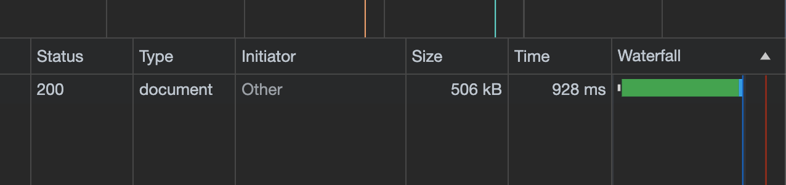
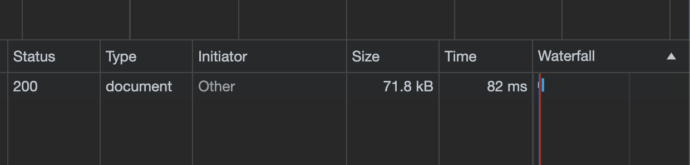


Combining Strapi with SvelteKit or other JS frameworks can make for a formidable tech stack suitable for various
business platforms. However, adopting a headless approach might impact page speed if requests are not server-side
propagated, or if the front-end stack and Strapi are deployed with different providers or in different regions. Today,
we explore caching in SvelteKit to boost your Time to First Byte (TTFB) and UX.


## Rest Cache

One notable plugin in the Strapi Marketplace is [Rest Cache](https://market.strapi.io/plugins/strapi-plugin-rest-cache).
This allows you to cache HTTP requests without extra calls to the database. It has multiple cache providers, including:

* `Memory`
* `Redis`
* `Couchebase`
* `Custom`

While Rest Cache effectively reduces database call times by caching content on the CMS side, it does not address the
inherent latency in direct requests from the JavaScript framework to the server, which can still impact overall page
load times.

## SvelteKit caching

Although the Rest Cache method works wonders to improve response times from the Strapi database, there may be times that
you need extra performance when making these requests. A practical solution for enhancing performance between these
frameworks is the implementation of [node-cache](https://github.com/node-cache/node-cache), a straightforward caching
module with functionalities akin to memcached and redis.

Here's a step-by-step breakdown:

1. When a request is made to Strapi, the cache is looked up by the request key.
2. If the data is persisted in the cache layer, it will be returned immediately.
3. If it isn't persisted, it will create the request and store it in memory.


### Creating the caching mechanism

It's useful to have a utility class or type that is responsible for requesting all data from Strapi. This will allow you
to set and clear the cache on all POST requests. Below is a small tutorial on how to implement the architecture as
defined in the ADR above.

### 1) Install Node Cache

`npm install node-cache`

### 2) Creating a cache class

A singleton cache instance will help as a wrapper for `node-cache`, which can be placed in a utility or service package.

`lib/server/cache.ts`

```typescript
import NodeCache from 'node-cache';

class SvelteCache {
    private cache: NodeCache;

    /**
     * Constructor for the Cache class.
     */
    constructor() {
       this.cache = new NodeCache();
    }

    /**
     * Retrieves a value from the cache.
     * @param {string} key The key to retrieve from the cache.
     * @returns {T | undefined} The cached value or undefined if not found.
     */
    get<T>(key: string): T | undefined {
       return this.cache.get<T>(key);
    }

    /**
     * Sets a value in the cache.
     * @param {string} key The key to store the value under.
     * @param {T} value The value to store in the cache.
     * @param {number} ttl The time to live in seconds. Optional.
     * @returns {boolean} True if the value was successfully stored.
     */
    set<T>(key: string, value: T, ttl?: number): boolean {
       return this.cache.set<T>(key, value, ttl);
    }

    /**
     * Invalidates the entire cache.
     */
    invalidateAll(): void {
       this.cache.flushAll();
    }
}

const Cache = new SvelteCache();
export default Cache;
```

### 3) Add the mechanism

#### Cache retrieval

First off, we need to check if the item resides in the cache. If it does, we can serve the data from memory. The
environment should also be checked for `development` so the cache can be disabled when editing.

```kotlin
// Try and retrieve the call from the cache.
if (method == 'GET' && !dev) {
	const cachedData = Cache.get<T>(url);
	if (cachedData) {
		return Promise.resolve(cachedData);
	}
}
```

#### Cache setting

After the request, we need to persist the data to the cache using the Strapi url as a key.

```cs
// Set the entity in the cache layer.
Cache.set(url, json);
```

#### All together

Below is an example of the cache layer tied together. The `find` method is used to retrieve content type entities, but
we can easily extend this to other methods that utilise `GET` requests, such as `findOne` or `findBySlug`

```typescript
import { stringify as QueryStringify } from 'qs';
import type {
	StrapiResponse,
	StrapiBaseRequestParams,
	StrapiRequestParams,
	StrapiError,
} from 'strapi-sdk-js';
import { dev } from '$app/environment';
import { PUBLIC_STRAPI_URL } from '$env/static/public';
import Cache from '$lib/server/cache';

class Strapi {

	/**
	 * Basic fetch request for Strapi
	 *
	 * @param  	method {string} - HTTP method
	 * @param  	url {string} - API path.
	 * @param   data {Record<any,any>} - BodyInit data.
	 * @param	params {StrapiBaseRequestParams} - Base Strapi parameters (fields & populate)
	 * @returns Promise<T>
	 */
	async request<T>(
		method: string,
		url: string,
		data?: Record<any, any>,
		params?: Params,
	): Promise<T> {
		url = `https://strapi.com/api${url}?${params ? QueryStringify(params) : ''}`;

		// Try and retrieve the call from the cache.
		if (method == 'GET' && !dev) {
			const cachedData = Cache.get<T>(url);
			if (cachedData) {
				return Promise.resolve(cachedData);
			}
		}

		return new Promise((resolve, reject) => {
			fetch(url, {
				method: method,
				body: data ? JSON.stringify(data) : null,
			})
				.then((res) => res.json())
				.then((json) => {
					if (json.error) {
						throw json;
					}
					// Set the entity in the cache layer.
					Cache.set(url, json);
					resolve(json);
				})
				.catch((err) => reject(err));
		});
	}

	/**
	 * Get a list of {content-type} entries
	 *
	 * @param  	contentType {string} Content type's name pluralized
	 * @param  	params {StrapiRequestParams} - Fields selection & Relations population
	 * @returns Promise<StrapiResponse<T>>
	 */
	find<T>(contentType: string, params?: StrapiRequestParams): Promise<StrapiResponse<T>> {
		return this.request('GET', `/${contentType}`, null, params as Params);
	}
}
```

## Cache Invalidation

What about the infamous cache invalidation? Strapi provides a great web-hook feature that can be triggered every time a
user updates an entry, which can be used to bust the SvelteKit cache. This can be achieved using the steps below.



### 1) Invalidation endpoint

To begin with, an endpoint needs to be created within SvelteKit to bust the cache.

This endpoint:

1. Checks to see if the API key is valid.
2. Calls `cache.invalidateAll()` to remove all items from the cache.

`api/cache/+server.ts`

```typescript
import { json } from '@sveltejs/kit';
import Cache from '$lib/server/cache';

/**
 * POST /cache
 * Endpoint to flush the cache, typically called from a Strapi webhook.
 */
export async function POST({ request }) {
    if (request.headers.get('X-ADev-API-Key') != "My Secret API Key") {
       return json(
          {
             success: false,
             message: 'Invalid credentials',
          },
          {
             status: 401,
          },
       );
    }

    // Flush the entire cache.
    Cache.invalidateAll();

    console.log(
       'Cache successfully flushed at: ' +
          new Date().toLocaleTimeString('en-GB', { hour12: false }),
    );

    return json({
       success: true,
       message: 'Cache successfully flushed',
    });
}
```

### 2) Setting up the webhook

Now we can set up a webhook to invalidate the cache every time an entry is updated within Strapi. Navigate to `Settings`
➝ `Webhooks` and create a new webhook with the URL of the SvelteKit application along with an API key.



## Results

We noticed a significant drop in TTFB for implementing the above method. Average request times were reduced by about
600ms, which is a huge boost in performance and page speed.

#### Before



#### After



## Going further

In advancing our caching strategy, we can refine our approach to cache invalidation by targeting specific endpoints. For
instance, if a user accesses the `/blog` endpoint, we have the capability to invalidate the cache specifically
for `/blog`, rather than clearing the entire cache.

## Wrapping up

In summary, the integration of caching mechanisms in a Strapi and SvelteKit setup significantly enhances performance,
notably reducing TTFB and improving UX. By implementing strategies such as using Rest Cache for CMS side optimisation
and node-cache for direct JavaScript framework requests, we can effectively mitigate latency issues. This approach not
only streamlines content delivery but also exemplifies the synergy between strategic caching and modern web
technologies, ultimately leading to faster and more responsive web applications.
